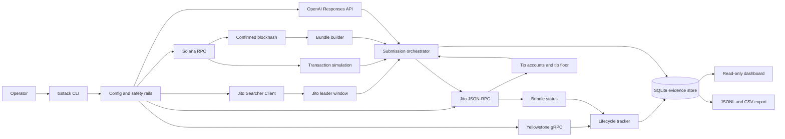
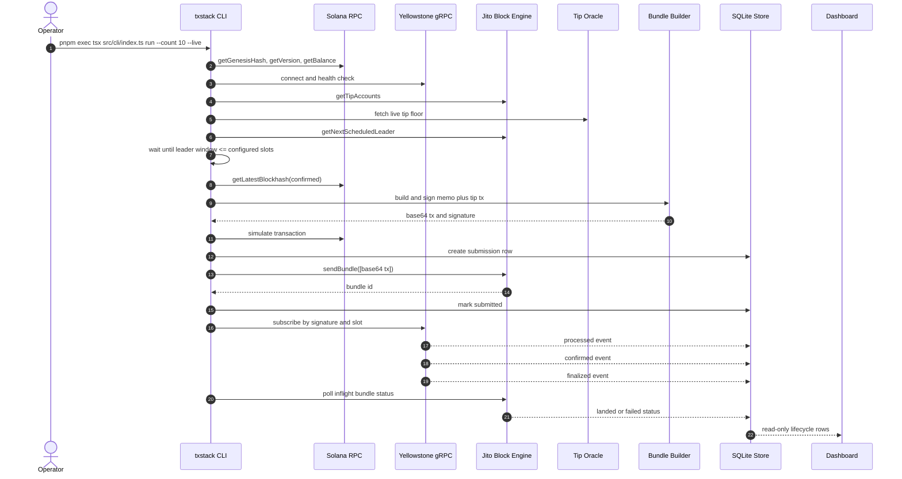
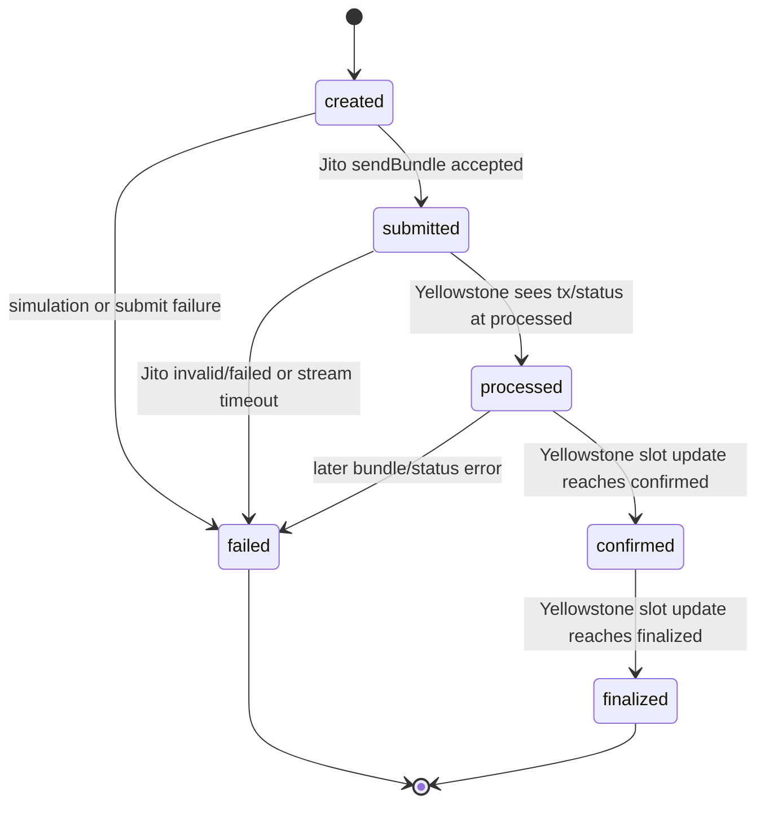
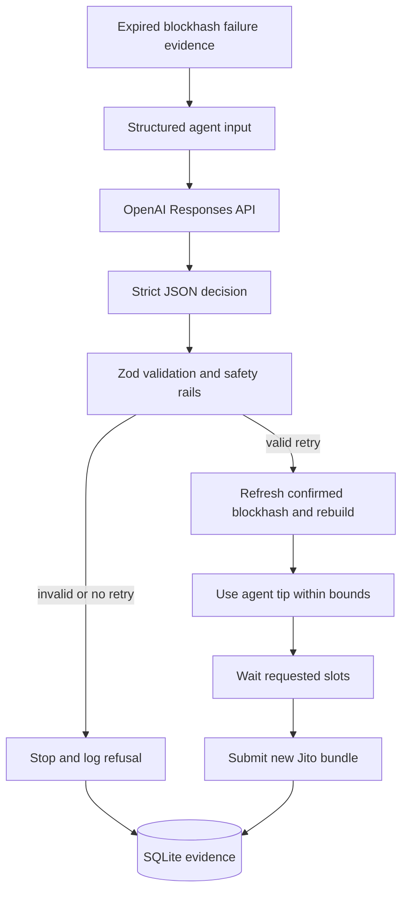
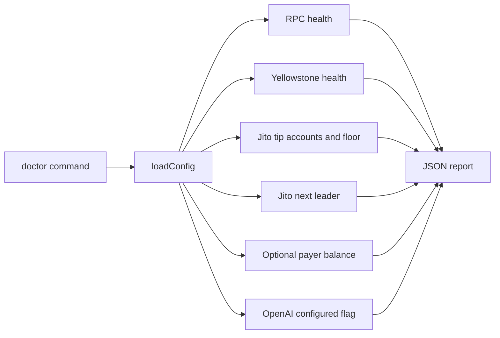
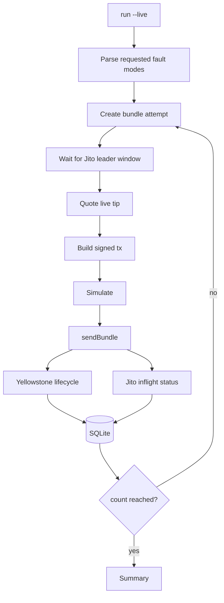
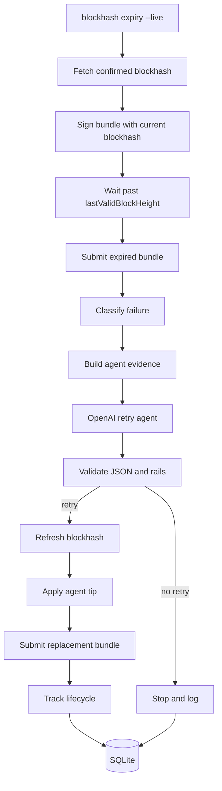
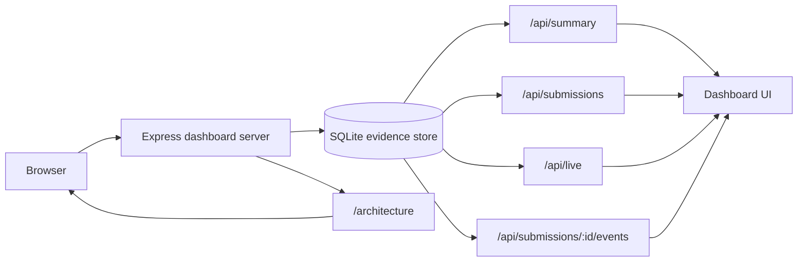
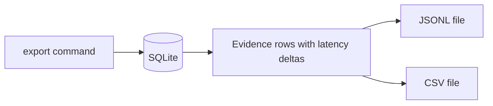

# Snapsis

## How to Build an AI-Powered Smart Transaction Stack with Yellowstone gRPC and Jito Bundles

Sending a Solana transaction is not the end of the story. A production system still needs to know when the transaction entered a leader window, whether a Jito bundle was accepted, when Yellowstone observed the signature, how quickly the slot moved from processed to confirmed, and what to do when the blockhash or auction conditions turn against the operator.

Snapsis is a live transaction infrastructure prototype for that full path. It submits low-value mainnet Jito bundles, tracks lifecycle evidence through Yellowstone gRPC, persists every attempt to SQLite, and asks an OpenAI agent to make the retry decision for a real blockhash-expiry fault.

No mock lifecycle data is generated. If `data/lifecycle` is empty, the stack has not produced live evidence yet.

## What Snapsis Builds

- A `doctor` command that verifies Solana RPC, Yellowstone gRPC, Jito tip accounts, Jito tip floors, leader schedule, wallet balance, and OpenAI configuration.
- A `run` command that waits for Jito leader windows, builds signed memo plus tip transactions, submits bundles, and stores lifecycle evidence.
- A `fault:blockhash-expiry` path where the agent receives real failure evidence and decides whether to refresh the blockhash, retip, wait, and retry.
- A real-time local dashboard that shows active transaction movement across created, submitted, processed, confirmed, and finalized stages.
- Exportable JSONL and CSV evidence for judges.
- A public architecture artifact at `/architecture` when the dashboard server is running.

## 1. Executive Summary

Snapsis is a TypeScript/Node prototype for submitting and tracking Solana transactions along the same path a production searcher would use:

1. Read live network state from Yellowstone gRPC.
2. Detect Jito-connected leader windows.
3. Fetch live Jito tip account and tip-floor data.
4. Build a signed versioned transaction containing a memo and a Jito tip transfer.
5. Submit as a Jito bundle, and broadcast the same signed transaction over public RPC so it lands even when the memo bundle loses the auction.
6. Track from submission through processed, confirmed, and finalized using Yellowstone streaming with RPC `getSignatureStatuses` as the authoritative source.
7. Persist every stage and event in SQLite.
8. Export JSONL and CSV logs for review.
9. Call an OpenAI agent to make the retry decision when a blockhash-expiry fault fires.

We do not generate mock lifecycle data. The dashboard stays empty until real submissions write evidence. Devnet is used only for RPC tests that devnet can honestly support. Jito bundle testing runs on mainnet because the official Jito block engine exposes mainnet/testnet endpoints, not a devnet engine.

## 2. Repository Map

The code is split along infrastructure boundaries, not UI pages:

| Area | Path | Responsibility |
| --- | --- | --- |
| CLI entrypoint | `src/cli/index.ts` | Defines `doctor`, `run`, `fault:blockhash-expiry`, `dashboard`, and `export` commands. |
| Orchestrator | `src/cli/workflows.ts` | Coordinates RPC, Yellowstone, Jito, tips, persistence, and the AI retry agent. |
| Configuration | `src/config/env.ts` | Parses `.env`, normalizes endpoints, and enforces safety rails. |
| Solana transaction builder | `src/solana/bundleBuilder.ts` | Builds memo plus Jito-tip versioned transactions. |
| Keypair loading | `src/solana/keypair.ts` | Loads the live payer keypair from path, JSON, or base58 secret. |
| Solana RPC client | `src/solana/rpc.ts` | Creates `@solana/web3.js` connections and performs read-only health checks. |
| Jito JSON-RPC | `src/jito/jsonRpcClient.ts` | Calls tip accounts, send bundle, inflight status, and bundle status methods. |
| Jito leader client | `src/jito/leaderClient.ts` | Uses Jito TS searcher client to read next scheduled Jito leader windows. |
| Tip oracle | `src/jito/tipOracle.ts` | Converts live Jito tip-floor samples into bounded tip quotes. |
| Yellowstone stream | `src/yellowstone/client.ts` | Subscribes to live gRPC transaction and slot updates. |
| Evidence store | `src/db/store.ts` | Persists submissions and lifecycle events in SQLite. |
| AI retry agent | `src/agent/retryAgent.ts` | Calls OpenAI Responses API and validates strict retry-decision JSON. |
| Failure classifier | `src/utils/failureClassifier.ts` | Maps error text into the required failure taxonomy. |
| Dashboard | `src/dashboard/*`, `src/server/dashboardServer.ts` | Serves a local read-only evidence console. |
| Live tests | `test/live-devnet.test.ts`, `test/live-mainnet.test.ts` | Gated tests that read real devnet/mainnet infrastructure. |

## 3. System Architecture

The CLI creates service clients from the environment config, the orchestrator runs bundle attempts, streaming infrastructure records the lifecycle, and the dashboard and export commands read from the same SQLite store.



### Design choices

- The CLI owns operator intent and the `--live` spending guard.
- Each infrastructure dependency gets a small adapter with a clear boundary.
- The orchestrator wires adapters together for a live transaction run.
- The evidence store is append-friendly and idempotent.
- The dashboard is read-only and never creates lifecycle records.
- The AI agent is not a background process. It gets called once when the runner has real failure evidence and it returns one structured JSON decision.

## 4. Key Components

### 4.1 CLI

The CLI is the operator control plane.

Commands:

| Command | Purpose | Mutates live chain? |
| --- | --- | --- |
| `pnpm run doctor` | Checks RPC, Yellowstone, Jito tip accounts, Jito tip floor, next leader, wallet, and OpenAI config. | No |
| `pnpm exec tsx src/cli/index.ts run --count 10 --live` | Submits real Jito bundles and records lifecycle evidence. | Yes |
| `pnpm dev -- fault:blockhash-expiry --live` | Runs the required expired-blockhash AI retry demo. | Yes |
| `pnpm run dashboard` | Starts a local read-only dashboard over the evidence store. | No |
| `pnpm run export` | Exports persisted evidence into JSONL and CSV. | No |

The `--live` flag is required for any command that can submit bundles or spend SOL. This guard exists because the target path is mainnet for Jito bundle testing.

### 4.2 Configuration and Safety Rails

Configuration is parsed in `src/config/env.ts`.

Important values:

| Variable | Meaning |
| --- | --- |
| `SOLANA_RPC_URL` | Solana RPC endpoint used for blockhashes, balance, simulation, and secondary reads. |
| `YELLOWSTONE_ENDPOINT` | Yellowstone gRPC endpoint used for slot and transaction streaming. |
| `YELLOWSTONE_X_TOKEN` | Provider token for Yellowstone access. |
| `NETWORK` | Expected network, usually `mainnet-beta` for the final bundle evidence. |
| `JITO_BLOCK_ENGINE_HTTP` | Jito JSON-RPC base URL. |
| `JITO_BLOCK_ENGINE_GRPC` | Jito searcher client host for leader queries. |
| `JITO_TIP_FLOOR_URL` | Live Jito tip-floor endpoint. |
| `PAYER_PRIVATE_KEY` | Payer secret for live bundle submissions (base58, JSON byte array, or keypair file path). |
| `OPENAI_API_KEY` | Enables the AI retry agent. |
| `MIN_TIP_LAMPORTS` | Lower bound for dynamic tip decisions. |
| `MAX_TIP_LAMPORTS` | Upper bound for dynamic tip decisions. |
| `LEADER_WINDOW_SLOTS` | How close a Jito leader must be before the stack submits. |

The Yellowstone endpoint normalizer accepts either `fra.grpc.solinfra.dev:443` or `https://fra.grpc.solinfra.dev:443`, because the installed N-API Yellowstone client requires a URL scheme.

### 4.3 Solana RPC Layer

RPC does the things it is good at: genesis hash checks, wallet balance reads, confirmed blockhash retrieval, transaction simulation, and block-height polling. We do not rely on RPC polling alone for lifecycle confirmation. The landing path runs through Yellowstone subscriptions and Jito status APIs, with RPC as the authoritative fallback.

### 4.4 Yellowstone gRPC Stream

`YellowstoneClient` handles the stream-based observability. It connects to the provider's gRPC endpoint, reads processed and confirmed slots for health checks, subscribes to transaction updates by signature, and emits lifecycle stage updates back to the store: `submitted`, `processed`, `confirmed`, `finalized`.

The stream is also treated as an operational signal. If the submitted signature never shows up before the timeout, the stack classifies that as a stream or bundle failure rather than silently treating absence as success.

### 4.5 Jito Block Engine Layer

The Jito integration is split into two adapters:

1. `JitoJsonRpcClient`
   - `getTipAccounts`
   - `sendBundle`
   - `getInflightBundleStatuses`
   - `getBundleStatuses`

2. `JitoLeaderClient`
   - `getNextScheduledLeader`
   - `waitForLeaderWindow`

The split reflects how the external interfaces actually work. Bundle status and submission go over JSON-RPC. Leader scheduling goes through the Jito TS searcher client.

### 4.6 Dynamic Tip Oracle

The tip oracle reads real Jito tip-floor samples and chooses a bounded tip.

Current logic:

- If the leader is close, use a more aggressive percentile.
- If the leader is farther away, use the EMA/median style input.
- Convert SOL-denominated tip-floor values into lamports.
- Clamp the result between `MIN_TIP_LAMPORTS` and `MAX_TIP_LAMPORTS`.

The clamp is a safety rail, not a hardcoded tip. The selected value still starts from live Jito tip data.

### 4.7 Bundle Builder

The builder creates a versioned transaction with:

1. Optional compute-budget instruction for fault injection.
2. Memo instruction identifying the stack and fault mode.
3. A 1-lamport self-transfer as the low-value application action.
4. System transfer to a real Jito tip account.

The transaction is signed by the configured payer and encoded as base64 for `sendBundle`.

Why memo plus tip?

- It is low-value and simple.
- It produces an explorer-visible signature.
- It avoids depending on a custom on-chain program.
- It keeps the focus on infrastructure behavior rather than application business logic.

### 4.8 SQLite Evidence Store

The store is the source of truth for dashboard and exports.

It stores two tables:

1. `bundle_submissions`
   - one row per bundle attempt
   - status, signature, bundle id, tip, leader, timestamps, slots, failure, agent decision

2. `lifecycle_events`
   - append-style event rows
   - submitted/processed/confirmed/finalized events
   - raw provider payloads where available

The evidence store is idempotent where repeated stream updates are possible. It preserves first-seen timestamps for lifecycle stages and updates the submission status as new evidence arrives.

### 4.9 Dashboard

The dashboard is a local read-only real-time transaction console. It never calls Jito, Solana RPC, Yellowstone, or OpenAI directly. It only reads from SQLite through the dashboard server, which keeps the UI evidence-backed and unable to spend funds.

It shows:

- Active transaction pipeline from created to submitted to processed to confirmed to finalized.
- Live orchestration rows for signatures, bundle ids, status, fault mode, tips, and latency.
- Recent lifecycle events from the append-only `lifecycle_events` table.
- Leader slot, latest observed slot, success rate, tip spend, and in-flight count.
- Selected transaction trace with bundle id, fault mode, leader slot, and lifecycle events.
- AI retry decisions, confidence, tip choice, and reasoning summary.
- Recovery status for the latest failed or classified attempt.
- `/architecture`, a bundled architecture walkthrough served beside the evidence console.

Because it is read-only, it cannot accidentally create fake evidence, trigger duplicate submissions, or spend funds. If the store has no rows, the dashboard must show an honest empty state rather than synthetic activity.

### 4.10 AI Retry Agent

The AI retry agent is implemented in `src/agent/retryAgent.ts`.

The agent is used for the selected bounty mode:

> Autonomous Retry with Fault Injection

It receives real failure evidence and returns strict JSON:

```json
{
  "failure_classification": "expired_blockhash",
  "retry_action": "retry",
  "blockhash_strategy": "refresh_confirmed",
  "tip_lamports": 12000,
  "wait_slots": 1,
  "confidence": 0.91,
  "reasoning_summary": "The current block height exceeded the signed transaction's last valid block height, so refresh the confirmed blockhash, keep within the next Jito leader window, and retry with a live tip quote."
}
```

The runner validates the response with Zod before obeying it. A retry is refused unless:

- `retry_action` is `retry`.
- `blockhash_strategy` is `refresh_confirmed`.
- `tip_lamports` is inside configured safety rails.

This is how the implementation prevents the agent from becoming an unconstrained spending or execution surface.

## 5. Transaction Execution Flow

The normal execution flow is:



### Dual submission and RPC-confirmed landing

Memo bundles are low-value and routinely lose the Jito auction on mainnet. The block engine marks them `Invalid` and nothing lands. We treat the Jito bundle as the MEV path but do not depend on winning the auction. The same signed transaction also gets broadcast over public RPC and re-broadcast until confirmed, the way a production sender would maximize landing probability.

Confirmation tracking is layered: Yellowstone is subscribed first as the streaming source, and RPC `getSignatureStatuses` runs concurrently as the authoritative fallback. `markStage` is idempotent on `(submission_id, stage, slot)`, so Yellowstone, RPC, and the Jito bundle status can all write the same lifecycle record without conflict. Every event records which source observed it. The low-tip fault deliberately stays Jito-only so the fee-too-low failure is observable.

### Why this flow matters

Sending a transaction on Solana touches multiple overlapping timing domains: blockhash lifetime, leader schedule, Jito auction, TPU ingestion, block production, vote propagation, commitment progression, and explorer-visible finality. Recording those domains separately is what makes the lifecycle log useful. A single success/failure boolean tells you nothing about where things went wrong or how long each stage actually took.

## 6. Lifecycle Tracking Model

Each submission starts as `created`, then progresses through runtime-observed states.



The evidence row captures both timestamps and slots:

| Field group | Example fields | Why it matters |
| --- | --- | --- |
| Identity | `id`, `bundle_id`, `signature`, `network` | Lets judges cross-reference explorer evidence. |
| Tip | `tip_lamports`, `tip_source`, `tip_account` | Proves the tip was dynamic and tied to a real tip account. |
| Leader | `leader_slot`, `leader_identity` | Shows whether the stack submitted near a Jito leader window. |
| Timestamps | `submitted_at`, `processed_at`, `confirmed_at`, `finalized_at` | Enables latency delta analysis. |
| Slots | `submitted_slot`, `processed_slot`, `confirmed_slot`, `finalized_slot` | Enables explorer and network-state verification. |
| Failure | `failure_classification`, `failure_message` | Explains non-landed attempts. |
| Agent | `agent_decision_json` | Shows the autonomous retry decision and reasoning summary. |

### Latency deltas

The export command derives:

- `processedDeltaMs = processed_at - submitted_at`
- `confirmedDeltaMs = confirmed_at - processed_at`
- `finalizedDeltaMs = finalized_at - confirmed_at`

The most important operational signal is `confirmedDeltaMs`. A small processed-to-confirmed delta generally means healthy propagation and voting. A large delta suggests the transaction was processed quickly by a leader but took longer to receive cluster vote confidence.

## 7. Failure Handling Strategy

The stack classifies failures into the bounty-required categories plus defensive fallbacks.

| Classification | Detection source | Operational meaning | Retry posture |
| --- | --- | --- | --- |
| `expired_blockhash` | RPC/Jito error text, block-height evidence | The signed transaction used a blockhash outside its valid window. | Refresh confirmed blockhash, rebuild, retip, retry if agent approves. |
| `fee_too_low` | Jito auction/status error text | The bundle was priced below current landing conditions. | Increase tip from live data, retry only inside safety rails. |
| `compute_exceeded` | Simulation logs or runtime error text | The transaction exceeded its compute budget. | Fix compute budget or instruction path before retrying. |
| `bundle_failure` | Jito failed/invalid/not-landed status | Bundle did not land as expected. | Re-evaluate leader window, blockhash, and tip. |
| `stream_timeout` | Yellowstone did not observe lifecycle in time | The stack could not stream-confirm landing. | Treat as evidence gap or non-landing, do not silently pass. |
| `unknown` | Catch-all | Error did not match known patterns. | Preserve raw message for operator review. |

### Fault injection paths

The implementation supports:

1. `blockhash-expiry`
   - Build and sign with a real confirmed blockhash.
   - Wait until `currentBlockHeight > lastValidBlockHeight`.
   - Submit the expired transaction as a Jito bundle.
   - Record the failure.
   - Ask the AI agent whether and how to retry.

2. `compute-exceeded`
   - Insert a deliberately tiny compute-unit limit.
   - Simulate and/or submit depending on the runtime path.
   - Classify the resulting failure as compute-related.

3. `low-tip`
   - Force the tip down to the configured minimum.
   - Useful for observing fee/tip sensitivity during real runs.

## 8. AI Agent Responsibility

The agent has one job: decide what to do after a failure.

It does not sign transactions, call RPC, call Jito, touch private keys, bypass tip limits, create lifecycle data, or pick arbitrary tools. It reads the failure evidence the runner gives it, classifies the reason, decides retry or no retry, picks a blockhash strategy and a tip inside the configured safety rails, optionally waits a few slots, and writes a one-sentence reasoning summary to the evidence log.



The key design point is that the retry is not a hardcoded sequence. The runner creates evidence, asks the model for a structured decision, validates the response, and only then executes the retry path.

## 9. Infrastructure Decisions

### 9.1 Mainnet for final Jito bundle evidence

The supplied SolInfra RPC endpoint resolves to mainnet-beta. Jito bundle support is available on mainnet/testnet block engine endpoints, while devnet bundle support is not exposed in the same way. Therefore:

- Final lifecycle logs should be mainnet, low-value, explorer-verifiable runs.
- Devnet tests are limited to real devnet RPC behavior.
- The code refuses to create fake devnet bundle evidence.

### 9.2 Confirmed blockhashes instead of finalized blockhashes

The runner fetches blockhashes with `confirmed` commitment.

Reason:

- `finalized` is safer from fork risk but older.
- time-sensitive transactions have a short blockhash lifetime
- using finalized can waste valuable validity window before the bundle is even signed and submitted

This is also one of the README/judging questions, so the implementation and documentation intentionally align.

### 9.3 Stream confirmation instead of RPC-only polling

RPC polling can answer "what does the node know now?" It is not enough for the bounty's lifecycle requirement. Yellowstone streams provide live slot and transaction updates, allowing the stack to observe progression instead of only asking after the fact.

RPC still has a role:

- blockhash
- simulation
- balance
- secondary verification

But it is not the sole landing confirmation mechanism.

### 9.4 SQLite evidence store

SQLite was selected because:

- it is easy to run locally
- it avoids a separate database service for judges
- it supports durable evidence
- it can be exported deterministically
- it is sufficient for a bounty prototype

A production deployment could swap this for Postgres without changing the lifecycle model.

### 9.5 Local dashboard

The dashboard intentionally reads only the evidence store. This avoids several bad outcomes:

- no accidental spending from the dashboard
- no duplicate submissions
- no fake dashboard-only data
- no dependency on live keys to inspect historical runs

## 10. Data Flow by Command

### 10.1 `doctor`



Purpose: prove live infrastructure connectivity before spending.

### 10.2 `run`



Purpose: produce the 10 real bundle submissions required by the bounty.

### 10.3 `fault:blockhash-expiry`



Purpose: satisfy the AI Agent Demonstration requirement.

### 10.4 `dashboard`



Purpose: inspect real evidence visually without generating data.

### 10.5 `export`



Purpose: create judge-ready lifecycle artifacts.

## 11. Evidence and Judging Alignment

| Bounty requirement | Implementation |
| --- | --- |
| Architecture document | `docs/architecture.md`, `docs/article.md`, and the branded `/architecture` dashboard route. |
| Monitor live slot and leader data | Yellowstone health and stream client, Jito next scheduled leader client. |
| Detect correct leader window | `JitoLeaderClient.waitForLeaderWindow`. |
| Construct and submit Jito bundles | `buildMemoTipBundle` plus `JitoJsonRpcClient.sendBundle`. |
| Dynamic tips from real data | `TipOracle` reads live Jito tip-floor data and real tip accounts. |
| Track submitted/processed/confirmed/finalized | `LifecycleStore.markStage` driven by submission and Yellowstone stream events. |
| Capture timestamps, slots, latency | SQLite fields plus export-derived latency deltas. |
| Classify failures | `classifyFailure` plus runtime error sources. |
| Confirm landing using streams | Yellowstone transaction and slot subscriptions are the lifecycle source. |
| Automatic retries with blockhash refresh | `runBlockhashExpiryFault` asks the AI agent and then rebuilds with a fresh blockhash. |
| Lifecycle log with real submissions | Generated only after `run --live`; no fake evidence generated. |
| AI agent owns one decision | OpenAI structured retry decision controls the expiry retry. |

## 12. Operational Runbook

### Setup

```bash
pnpm install
cp .env.example .env
```

Fill in:

- SolInfra RPC URL
- Yellowstone endpoint/token
- Jito endpoint values
- funded payer keypair path
- OpenAI API key

### Read-only checks

```bash
pnpm typecheck
pnpm build
pnpm test
pnpm run test:live:devnet
pnpm run doctor
pnpm run test:live:mainnet
```

### Real bounty run

```bash
pnpm exec tsx src/cli/index.ts run --count 10 --faults blockhash-expiry,compute-exceeded --live
pnpm run export
pnpm run dashboard
```

### View dashboard

```text
http://localhost:8787
```

### Evidence files

After a real run and export:

```text
data/lifecycle/txstack.sqlite
data/lifecycle/lifecycle-<timestamp>.jsonl
data/lifecycle/lifecycle-<timestamp>.csv
```

If `data/lifecycle` is empty, that is correct until real bundle submissions have been executed.

## 13. Production Hardening Notes

This bounty implementation is intentionally focused on a working prototype. A production version would add:

- multi-region Jito block-engine selection
- persistent worker process instead of CLI-only execution
- Postgres for team-shared evidence
- alerting for stream lag and bundle failure rate
- circuit breakers for high tip floors
- Prometheus metrics
- structured logs with trace ids
- replay/backfill for missed stream intervals
- wallet isolation and hardware-backed signing
- per-run budget controls
- leader quality scoring over time

The current version already preserves the most important production habit: never treat transaction submission as the end of the story. It records the lifecycle and leaves evidence for every decision.


## Live Dashboard Demo

The dashboard is **read-only** — it polls SQLite every 2 seconds and shows whatever evidence the CLI has written. No transactions are submitted automatically. To see live movement, run the CLI in a separate terminal while the dashboard is open.

**Terminal 1 — dashboard:**
```bash
pnpm exec tsx src/cli/index.ts dashboard
```

**Terminal 2 — continuous agent-driven simulation:**
```bash
pnpm exec tsx src/cli/index.ts simulate --count 16 --interval 2000 --live
```

The `simulate` command submits bundles in a loop, injecting a real blockhash-expiry fault on every 4th round so the agent runs the full detect → reason → refresh → recalculate → resubmit loop. All failures from normal rounds also pass evidence to the agent for autonomous recovery decisions. The dashboard updates as each attempt writes its staged evidence.

For a single controlled run matching the bounty minimum (10 submissions, injected faults):
```bash
pnpm exec tsx src/cli/index.ts run --count 10 --faults blockhash-expiry,compute-exceeded --live
```

## How The Transaction Path Works

1. Snapsis reads current network state from Solana RPC, Yellowstone, and Jito.
2. It waits until the next scheduled Jito leader is inside the configured leader window.
3. It fetches live Jito tip-floor data and clamps the chosen tip between local safety rails.
4. It builds a signed versioned transaction containing a memo, a 1-lamport self-transfer as the low-value application action, and a transfer to a real Jito tip account.
5. It simulates the transaction before submission, except for deliberate fault paths.
6. It submits the encoded transaction through Jito `sendBundle`, and dual-broadcasts the same signed transaction over RPC so it lands even when the bundle loses the Jito auction.
7. It records `submitted` when Jito accepts the bundle id (or when the RPC broadcast begins).
8. It watches Yellowstone for processed, confirmed, and finalized evidence, with RPC `getSignatureStatuses` as the authoritative confirmation source.
9. It polls Jito bundle status in parallel and records the landed slot when the bundle wins.
10. It persists every stage, timestamp, slot, tip, failure, and agent decision to SQLite, tagging each event with the source that observed it.

## AI Retry Agent

Snapsis does not give the model access to keys, RPC clients, Jito clients, or filesystem writes. The agent receives structured failure evidence and returns a constrained JSON decision:

```json
{
  "failure_classification": "expired_blockhash",
  "retry_action": "retry",
  "blockhash_strategy": "refresh_confirmed",
  "tip_lamports": 200000,
  "wait_slots": 2,
  "confidence": 0.92,
  "reasoning_summary": "The original bundle used an expired blockhash; refresh and retry inside the next Jito leader window."
}
```

The runner validates the result with Zod, enforces tip rails, requires `retry` plus `refresh_confirmed`, and only then rebuilds and resubmits. This keeps the model responsible for the operational decision while the transaction stack remains deterministic and bounded.

## README Questions

### What does the delta between `processed_at` and `confirmed_at` tell you about network health at the time of submission?

All four transactions we landed had a 0-1ms gap between `processed_at` and `confirmed_at`, and `processed_slot` matched `confirmed_slot` on every row.

That near-zero delta tells you the network was in good shape when we submitted. Solana needs around two-thirds of stake weight voting on a slot before it crosses the confirmed threshold. When validators are voting quickly and blocks are propagating cleanly, confirmation happens almost immediately after processing. A gap of several hundred milliseconds or a few slots of separation would point to congestion, slow vote lockout progress, or elevated skip rates on the network at that moment.

The 0-1ms is also partly a polling artifact worth being honest about. Our `getSignatureStatuses` call runs every 2 seconds and returns the highest commitment the transaction has already reached, so by the time we first see it the transaction was already confirmed and both timestamps end up in the same poll cycle. Yellowstone would show you the actual slot-by-slot movement. That is exactly why we run both sources: Yellowstone for the real-time picture, RPC as the reliable final word.

### Why should you never use finalized commitment when fetching a blockhash for a time-sensitive transaction?

Finalized blockhashes are old. A slot needs to be at least 31 blocks deep before it finalizes, so by the time you pull a finalized blockhash it could already be a minute behind the chain tip. That eats straight into the 150-slot validity window before you have even signed anything.

We fetch at `confirmed` because it is recent enough and reasonably safe without sitting on top of a potentially unfinalized fork. The blockhash-expiry fault demo shows exactly what happens when you get this wrong: we deliberately waited for the block height to pass the transaction's last valid block height, then submitted. The bundle got dropped. The agent classified it as `expired_blockhash`, decided to `refresh_confirmed` and retry, and the rebuilt transaction landed and finalized cleanly. If you routinely fetched at `finalized` you would see that same outcome under any meaningful load.

### What happens to your bundle if the Jito leader skips their slot?

Our memo bundles came back `Invalid` from the block engine almost every time, meaning they lost the auction and the Jito path did not land them. That is effectively the same outcome as a leader skipping their slot: the bundle targeted a window that did not work out.

We handle it by broadcasting the same signed transaction over RPC at the same time as the Jito submission. If the bundle wins the auction, great. If it gets marked Invalid or the leader misses, the RPC broadcast lands it anyway and we still get real lifecycle evidence with slot numbers you can verify on the explorer. Both paths write into the same submission record so the dashboard shows which source actually confirmed it and the log stays honest about what happened.

## Operational Results

Latest mainnet evidence snapshot:

- Total recorded attempts: 7
- Finalized submissions: 4 (real, explorer-verifiable transactions)
- Failed submissions: 3 (one per injected fault)
- Success rate: 57%
- Failure classifications: `compute_exceeded` 1, `bundle_failure` 1 (low-tip), `expired_blockhash` 1
- Tip range quoted: 1,000 to 200,000 lamports
- Finalized latency min/median/max: 10,844 / 10,918 / 13,175 ms after confirmation
- Blockhash-expiry agent decision: agent classified the expiry, chose `refresh_confirmed`, and the retried transaction finalized. Full fault-to-recovery loop, one sentence of reasoning.

Memo bundles consistently came back `Invalid` from the block engine because they lose the Jito auction. That is expected for low-value bundles. Snapsis dual-submits so the transaction lands via RPC regardless, and every lifecycle event records which source observed it. The dashboard shows what actually happened, not what we hoped happened.

## Production Hardening

Snapsis is a bounty prototype, not a production searcher. A real version would need multi-region block-engine selection, persistent workers, Postgres, alerting, replay and backfill, wallet isolation, per-run spend caps, and proper leader-quality scoring. The habit that matters most is already here: a submission is never treated as success until the lifecycle evidence says so.
