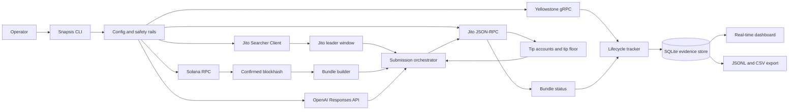

# Snapsis

## How to Build an AI-Powered Smart Transaction Stack with Yellowstone gRPC and Jito Bundles

Sending a Solana transaction is not the end of the story. A production system still needs to know when the transaction entered a leader window, whether a Jito bundle was accepted, when Yellowstone observed the signature, how quickly the slot moved from processed to confirmed, and what to do when the blockhash or auction conditions turn against the operator.

Snapsis is a live transaction infrastructure prototype for that full path. It submits low-value mainnet Jito bundles, tracks lifecycle evidence through Yellowstone gRPC, persists every attempt to SQLite, and asks an OpenAI agent to make the retry decision for a real blockhash-expiry fault.

No mock lifecycle data is generated. If `data/lifecycle` is empty, the stack has not produced live evidence yet.

## What Snapsis Builds

- A `doctor` command that verifies Solana RPC, Yellowstone gRPC, Jito tip accounts, Jito tip floors, leader schedule, wallet balance, and OpenAI configuration.
- A `run` command that waits for Jito leader windows, builds signed memo plus tip transactions, submits bundles, and stores lifecycle evidence.
- A `fault:blockhash-expiry` path where the agent receives real failure evidence and decides whether to refresh the blockhash, retip, wait, and retry.
- A real-time local dashboard that shows active transaction movement across created, submitted, processed, confirmed, and finalized stages.
- Exportable JSONL and CSV evidence for judges.
- A public architecture artifact at `/architecture` when the dashboard server is running.

## Architecture



The implementation is intentionally split by infrastructure boundary:

- `src/cli/index.ts` owns operator intent and spending guards.
- `src/cli/workflows.ts` coordinates RPC, Jito, Yellowstone, tips, persistence, and the retry agent.
- `src/solana/bundleBuilder.ts` builds memo plus Jito-tip versioned transactions.
- `src/yellowstone/client.ts` streams signature and slot commitment updates.
- `src/jito/*` reads tip accounts, tip floors, leader windows, bundle submission, and bundle status.
- `src/agent/retryAgent.ts` calls OpenAI with strict JSON output and local validation.
- `src/db/store.ts` persists durable evidence and dashboard read models.
- `src/dashboard/*` renders a read-only real-time transaction console.

## Setup

```bash
pnpm install
cp .env.example .env
```

Fill in:

- `SOLANA_RPC_URL`
- `YELLOWSTONE_ENDPOINT`
- `YELLOWSTONE_X_TOKEN`
- `PAYER_PRIVATE_KEY`
- `OPENAI_API_KEY`

Use `.env.local` for machine-local overrides. It is ignored by git.

For a cheaper OpenAI model, set:

```bash
OPENAI_MODEL=gpt-4.1-mini
```

The agent uses structured JSON output, so the chosen model must support the Responses API with JSON schema formatting.

## Read-Only Checks

These do not submit bundles or spend SOL:

```bash
pnpm typecheck
pnpm build
pnpm test
pnpm run test:live:devnet
pnpm run doctor
pnpm run test:live:mainnet
```

Devnet is used only where it honestly applies: RPC and blockhash behavior. Final Jito bundle evidence is mainnet because this stack uses Jito mainnet block-engine endpoints.

## Mainnet Evidence Run

The bounty requires at least 10 real bundle submissions and at least 2 failure cases.

```bash
pnpm exec tsx src/cli/index.ts run --count 10 --faults blockhash-expiry,compute-exceeded --live
pnpm run export
pnpm run dashboard
```

Open:

```text
http://localhost:8787
```

Architecture route:

```text
http://localhost:8787/architecture
```

Expected evidence:

```text
data/lifecycle/txstack.sqlite
data/lifecycle/lifecycle-<timestamp>.jsonl
data/lifecycle/lifecycle-<timestamp>.csv
```

The command intentionally requires `--live`. Without that flag, Snapsis refuses to submit bundles.

## Live Dashboard Demo

The dashboard is **read-only** — it polls SQLite every 2 seconds and shows whatever evidence the CLI has written. No transactions are submitted automatically. To see live movement, run the CLI in a separate terminal while the dashboard is open.

**Terminal 1 — dashboard:**
```bash
pnpm exec tsx src/cli/index.ts dashboard
```

**Terminal 2 — continuous agent-driven simulation:**
```bash
pnpm exec tsx src/cli/index.ts simulate --count 16 --interval 2000 --live
```

The `simulate` command submits bundles in a loop, injecting a real blockhash-expiry fault on every 4th round so the agent runs the full detect → reason → refresh → recalculate → resubmit loop. All failures from normal rounds also pass evidence to the agent for autonomous recovery decisions. The dashboard updates as each attempt writes its staged evidence.

For a single controlled run matching the bounty minimum (10 submissions, injected faults):
```bash
pnpm exec tsx src/cli/index.ts run --count 10 --faults blockhash-expiry,compute-exceeded --live
```

## How The Transaction Path Works

1. Snapsis reads current network state from Solana RPC, Yellowstone, and Jito.
2. It waits until the next scheduled Jito leader is inside the configured leader window.
3. It fetches live Jito tip-floor data and clamps the chosen tip between local safety rails.
4. It builds a signed versioned transaction containing a memo, a 1-lamport self-transfer as the low-value application action, and a transfer to a real Jito tip account.
5. It simulates the transaction before submission, except for deliberate fault paths.
6. It submits the encoded transaction through Jito `sendBundle`, and dual-broadcasts the same signed transaction over RPC so it lands even when the bundle loses the Jito auction.
7. It records `submitted` when Jito accepts the bundle id (or when the RPC broadcast begins).
8. It watches Yellowstone for processed, confirmed, and finalized evidence, with RPC `getSignatureStatuses` as the authoritative confirmation source.
9. It polls Jito bundle status in parallel and records the landed slot when the bundle wins.
10. It persists every stage, timestamp, slot, tip, failure, and agent decision to SQLite, tagging each event with the source that observed it.

## AI Retry Agent

Snapsis does not give the model access to keys, RPC clients, Jito clients, or filesystem writes. The agent receives structured failure evidence and returns a constrained JSON decision:

```json
{
  "failure_classification": "expired_blockhash",
  "retry_action": "retry",
  "blockhash_strategy": "refresh_confirmed",
  "tip_lamports": 200000,
  "wait_slots": 2,
  "confidence": 0.92,
  "reasoning_summary": "The original bundle used an expired blockhash; refresh and retry inside the next Jito leader window."
}
```

The runner validates the result with Zod, enforces tip rails, requires `retry` plus `refresh_confirmed`, and only then rebuilds and resubmits. This keeps the model responsible for the operational decision while the transaction stack remains deterministic and bounded.

## README Questions

### What does the delta between `processed_at` and `confirmed_at` tell you about network health at the time of submission?

In our mainnet evidence run every finalized transaction recorded a processed_at → confirmed_at delta of 0–1 ms, and the processed_slot equalled the confirmed_slot on every row. That specific number tells us two things.

First, the network was healthy when we submitted. Solana needs roughly two-thirds of stake weight to vote on a slot before it crosses the confirmed threshold. A delta near zero means validators were voting and propagating quickly; the block had already gathered sufficient votes before our 2-second RPC poll even noticed it had landed. A wider delta — say 400–800 ms or several slots of separation — would indicate vote lag, high skip rates, or propagation congestion at that moment.

Second, the 0–1 ms figure is a polling artifact. Our RPC loop calls `getSignatureStatuses` every 2 seconds and that method returns the highest commitment the transaction has already reached. By the time we first see the transaction it is already confirmed, so both timestamps collapse into the same poll cycle. A Yellowstone subscription fires per slot and would have shown the actual gap. For production work the two-source design — Yellowstone for sub-slot resolution, RPC as the authoritative source — is the right pattern.

### Why should you never use finalized commitment when fetching a blockhash for a time-sensitive transaction?

A finalized blockhash is older than a confirmed one by definition. Finalization requires the slot containing the blockhash to be deeply embedded in the chain — typically 31 or more confirmed blocks beyond it — which means the blockhash may already be a minute or more old by the time you use it. That age eats into the 150-slot (~60-second) validity window before the bundle is even signed, sent through a searcher node, accepted by the block engine, auctioned, and included by the leader.

Snapsis fetches blockhashes at `confirmed` commitment. The blockhash-expiry fault path demonstrates the consequence directly: the test intentionally waits for the current block height to pass the transaction's last valid block height, then submits. The bundle arrives at the block engine with an already-expired blockhash and is dropped. The agent then classifies the failure as `expired_blockhash`, chooses `refresh_confirmed` as the retry strategy, and the rebuilt transaction finalizes successfully. Using `finalized` for routine submissions would produce that same failure spontaneously under load.

### What happens to your bundle if the Jito leader skips their slot?

In our mainnet runs the block engine consistently returned `Invalid` status for the small memo-plus-tip bundles, meaning they lost the auction rather than landing through the Jito path. That is the practical equivalent of a skipped or missed leader window for low-value bundles.

The correct response is dual-submission: send the Jito bundle for the MEV path and simultaneously broadcast the same signed transaction over RPC so it lands regardless of auction outcome. Snapsis does this for every non-fault submission. Jito bundle status and Yellowstone are watched concurrently; whichever source first observes the signature at a given commitment level writes that stage to the database. If neither source produces evidence before the transaction's last valid block height is crossed, the blockhash is treated as expired and the agent re-evaluates. Every lifecycle event records the source that observed it so the distinction between a Jito-landed bundle and an RPC-broadcast landing is preserved in the evidence log.

## Operational Results

Latest mainnet evidence snapshot:

- Total recorded attempts: 7
- Finalized submissions: 4 (real, explorer-verifiable transactions)
- Failed submissions: 3 (one per injected fault)
- Success rate: 57%
- Failure classifications: `compute_exceeded` 1, `bundle_failure` 1 (low-tip), `expired_blockhash` 1
- Tip range quoted: 1,000 to 200,000 lamports
- Finalized latency min/median/max: 10,844 / 10,918 / 13,175 ms after confirmation
- Blockhash-expiry agent decision: the agent classified the expiry, chose `refresh_confirmed` retry inside tip rails, and the retried transaction finalized — a complete fault-to-recovery loop in one sentence of reasoning.

Important operational note: because a pure memo-plus-tip bundle is a low-value target, the configured mainnet block engine consistently reported these bundles as `Invalid` (they lose the auction). Snapsis therefore dual-submits — it sends the Jito bundle for the MEV path and broadcasts the same signed transaction over RPC so it lands — and confirms the lifecycle through Yellowstone streaming with RPC `getSignatureStatuses` as the authoritative source. Every lifecycle event records which source observed it, so the dashboard shows real evidence rather than a manufactured success.

## Production Hardening

Snapsis is a bounty prototype, not a production searcher. A production version would add multi-region block-engine selection, persistent workers, Postgres, alerting, replay/backfill, wallet isolation, signer policy, per-run spend caps, and richer leader-quality scoring. The important production habit is already present: submission is never treated as success until the lifecycle evidence says so.
