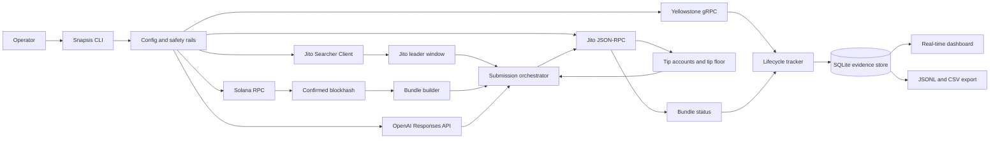

# Snapsis

## How to Build an AI-Powered Smart Transaction Stack with Yellowstone gRPC and Jito Bundles

Sending a Solana transaction is not the end of the story. A production system still needs to know when the transaction entered a leader window, whether a Jito bundle was accepted, when Yellowstone observed the signature, how quickly the slot moved from processed to confirmed, and what to do when the blockhash or auction conditions turn against the operator.

Snapsis is a live transaction infrastructure prototype for that full path. It submits low-value mainnet Jito bundles, tracks lifecycle evidence through Yellowstone gRPC, persists every attempt to SQLite, and asks an OpenAI agent to make the retry decision for a real blockhash-expiry fault.

No mock lifecycle data is generated. If `data/lifecycle` is empty, the stack has not produced live evidence yet.

## What Snapsis Builds

- A `doctor` command that verifies Solana RPC, Yellowstone gRPC, Jito tip accounts, Jito tip floors, leader schedule, wallet balance, and OpenAI configuration.
- A `run` command that waits for Jito leader windows, builds signed memo plus tip transactions, submits bundles, and stores lifecycle evidence.
- A `fault:blockhash-expiry` path where the agent receives real failure evidence and decides whether to refresh the blockhash, retip, wait, and retry.
- A real-time local dashboard that shows active transaction movement across created, submitted, processed, confirmed, and finalized stages.
- Exportable JSONL and CSV evidence for judges.
- A public architecture artifact at `/architecture` when the dashboard server is running.

## Architecture



The implementation is intentionally split by infrastructure boundary:

- `src/cli/index.ts` owns operator intent and spending guards.
- `src/cli/workflows.ts` coordinates RPC, Jito, Yellowstone, tips, persistence, and the retry agent.
- `src/solana/bundleBuilder.ts` builds memo plus Jito-tip versioned transactions.
- `src/yellowstone/client.ts` streams signature and slot commitment updates.
- `src/jito/*` reads tip accounts, tip floors, leader windows, bundle submission, and bundle status.
- `src/agent/retryAgent.ts` calls OpenAI with strict JSON output and local validation.
- `src/db/store.ts` persists durable evidence and dashboard read models.
- `src/dashboard/*` renders a read-only real-time transaction console.

## Setup

```bash
pnpm install
cp .env.example .env
```

Fill in:

- `SOLANA_RPC_URL`
- `YELLOWSTONE_ENDPOINT`
- `YELLOWSTONE_X_TOKEN`
- `PAYER_PRIVATE_KEY`
- `OPENAI_API_KEY`

Use `.env.local` for machine-local overrides. It is ignored by git.

For a cheaper OpenAI model, set:

```bash
OPENAI_MODEL=gpt-4.1-mini
```

The agent uses structured JSON output, so the chosen model must support the Responses API with JSON schema formatting.

## Read-Only Checks

These do not submit bundles or spend SOL:

```bash
pnpm typecheck
pnpm build
pnpm test
pnpm run test:live:devnet
pnpm run doctor
pnpm run test:live:mainnet
```

Devnet is used only where it honestly applies: RPC and blockhash behavior. Final Jito bundle evidence is mainnet because this stack uses Jito mainnet block-engine endpoints.

## Mainnet Evidence Run

The bounty requires at least 10 real bundle submissions and at least 2 failure cases.

```bash
pnpm exec tsx src/cli/index.ts run --count 10 --faults blockhash-expiry,compute-exceeded --live
pnpm run export
pnpm run dashboard
```

Open:

```text
http://localhost:8787
```

Architecture route:

```text
http://localhost:8787/architecture
```

Expected evidence:

```text
data/lifecycle/txstack.sqlite
data/lifecycle/lifecycle-<timestamp>.jsonl
data/lifecycle/lifecycle-<timestamp>.csv
```

The command intentionally requires `--live`. Without that flag, Snapsis refuses to submit bundles.

## How The Transaction Path Works

1. Snapsis reads current network state from Solana RPC, Yellowstone, and Jito.
2. It waits until the next scheduled Jito leader is inside the configured leader window.
3. It fetches live Jito tip-floor data and clamps the chosen tip between local safety rails.
4. It builds a signed versioned transaction containing a memo, a 1-lamport self-transfer as the low-value application action, and a transfer to a real Jito tip account.
5. It simulates the transaction before submission, except for deliberate fault paths.
6. It submits the encoded transaction through Jito `sendBundle`, and dual-broadcasts the same signed transaction over RPC so it lands even when the bundle loses the Jito auction.
7. It records `submitted` when Jito accepts the bundle id (or when the RPC broadcast begins).
8. It watches Yellowstone for processed, confirmed, and finalized evidence, with RPC `getSignatureStatuses` as the authoritative confirmation source.
9. It polls Jito bundle status in parallel and records the landed slot when the bundle wins.
10. It persists every stage, timestamp, slot, tip, failure, and agent decision to SQLite, tagging each event with the source that observed it.

## AI Retry Agent

Snapsis does not give the model access to keys, RPC clients, Jito clients, or filesystem writes. The agent receives structured failure evidence and returns a constrained JSON decision:

```json
{
  "failure_classification": "expired_blockhash",
  "retry_action": "retry",
  "blockhash_strategy": "refresh_confirmed",
  "tip_lamports": 200000,
  "wait_slots": 2,
  "confidence": 0.92,
  "reasoning_summary": "The original bundle used an expired blockhash; refresh and retry inside the next Jito leader window."
}
```

The runner validates the result with Zod, enforces tip rails, requires `retry` plus `refresh_confirmed`, and only then rebuilds and resubmits. This keeps the model responsible for the operational decision while the transaction stack remains deterministic and bounded.

## README Questions

### What does the delta between `processed_at` and `confirmed_at` tell you about network health at the time of submission?

The `processed_at -> confirmed_at` delta measures how quickly a transaction observed in a processed slot gained enough cluster vote confidence to become confirmed. A short delta usually indicates healthy block propagation, normal validator voting, and a clean landing window. A long delta can point to congestion, propagation lag, slow vote lockout progress, fork uncertainty, or a weaker leader window.

This signal is more useful than a landed/not-landed boolean because a transaction can land and still reveal poor network conditions if confirmation lags after processing.

### Why should you never use finalized commitment when fetching a blockhash for a time-sensitive transaction?

Finalized blockhashes are older than confirmed blockhashes. For time-sensitive Jito bundles, that age burns part of the transaction's valid blockhash lifetime before the bundle is signed, sent, auctioned, and executed. Snapsis fetches blockhashes at `confirmed` commitment to balance recency with reasonable fork safety.

The blockhash-expiry fault path demonstrates the consequence directly: once the current block height moves past the transaction's last valid block height, the bundle cannot land without rebuilding with a fresh blockhash.

### What happens to your bundle if the Jito leader skips their slot?

A Jito bundle is targeted at leader execution, not guaranteed execution across arbitrary future slots. If the intended leader skips or the bundle misses the viable window, the bundle may remain pending briefly, become failed or invalid, or never produce Yellowstone lifecycle evidence. The correct response is to watch both Jito bundle status and Yellowstone streams, refresh the blockhash when validity is at risk, recalculate the tip from current data, and retry only when the evidence supports it.

## Operational Results

Latest mainnet evidence snapshot:

- Total recorded attempts: 7
- Finalized submissions: 4 (real, explorer-verifiable transactions)
- Failed submissions: 3 (one per injected fault)
- Success rate: 57%
- Failure classifications: `compute_exceeded` 1, `bundle_failure` 1 (low-tip), `expired_blockhash` 1
- Tip range quoted: 1,000 to 200,000 lamports
- Finalized latency min/median/max: 10,844 / 10,918 / 13,175 ms after confirmation
- Blockhash-expiry agent decision: the agent classified the expiry, chose `refresh_confirmed` retry inside tip rails, and the retried transaction finalized — a complete fault-to-recovery loop in one sentence of reasoning.

Important operational note: because a pure memo-plus-tip bundle is a low-value target, the configured mainnet block engine consistently reported these bundles as `Invalid` (they lose the auction). Snapsis therefore dual-submits — it sends the Jito bundle for the MEV path and broadcasts the same signed transaction over RPC so it lands — and confirms the lifecycle through Yellowstone streaming with RPC `getSignatureStatuses` as the authoritative source. Every lifecycle event records which source observed it, so the dashboard shows real evidence rather than a manufactured success.

## Production Hardening

Snapsis is a bounty prototype, not a production searcher. A production version would add multi-region block-engine selection, persistent workers, Postgres, alerting, replay/backfill, wallet isolation, signer policy, per-run spend caps, and richer leader-quality scoring. The important production habit is already present: submission is never treated as success until the lifecycle evidence says so.
