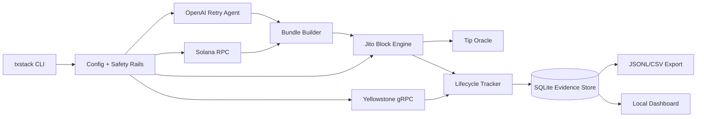

# Smart Transaction Stack Architecture

Public architecture document source. Publish this content to Google Docs, Notion, Figma, or another public URL before final bounty submission.

## System Overview

The stack is a TypeScript/Node service that coordinates four live systems:

1. Solana RPC for blockhashes, balance checks, simulation, and secondary verification.
2. Yellowstone gRPC for live slots, transaction signature updates, and commitment progression.
3. Jito Block Engine for leader-window awareness, tip accounts, bundle submission, and bundle status.
4. OpenAI Responses API for structured autonomous retry decisions.

The CLI owns operator workflows. The dashboard is read-only and shows the live state recorded by the runner.

## Data Flow

1. `txstack run` checks wallet balance, current slot, Yellowstone connectivity, Jito tip accounts, and live tip floor.
2. The runner waits until the next Jito-connected leader is inside the configured slot window.
3. It fetches a `confirmed` blockhash and builds a versioned transaction containing memo/self-transfer logic plus an in-transaction Jito tip.
4. The signed transaction is submitted as a Jito bundle.
5. Yellowstone subscriptions record processed, confirmed, and finalized stages by signature and slot.
6. Jito status APIs record bundle-level landed, failed, pending, or invalid states.
7. Every stage is persisted idempotently in SQLite and exportable as judge evidence.

## Failure Handling

Failures are classified as:

- `expired_blockhash`
- `fee_too_low`
- `compute_exceeded`
- `bundle_failure`
- `stream_timeout`
- `unknown`

The blockhash-expiry fault intentionally signs with a valid blockhash, waits until it expires, submits, then hands the failure evidence to the AI agent. The agent must decide whether to retry, how to refresh the blockhash, and what new tip to use.

## AI Agent Responsibility

The selected bounty mode is **Autonomous Retry with Fault Injection**. The agent receives only real runtime evidence and returns strict JSON:

- failure classification
- retry/no-retry decision
- blockhash strategy
- tip amount
- leader wait slots
- confidence
- concise reasoning summary

The runner refuses to retry unless the agent returns `retry_action: "retry"` with a valid tip inside safety rails.

## Infrastructure Decisions

- Mainnet Jito bundle tests are required because Jito exposes Mainnet/Testnet block engines, not Devnet block engines.
- Devnet live tests cover generic RPC and stream behavior only.
- `confirmed` blockhashes balance recency and fork risk; `finalized` blockhashes are intentionally avoided for time-sensitive bundles.
- SQLite keeps the prototype easy to run and produces deterministic export artifacts.
- No mock data is generated for lifecycle evidence.
