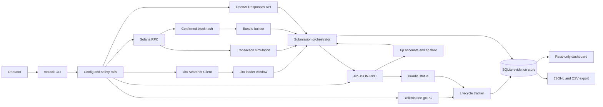
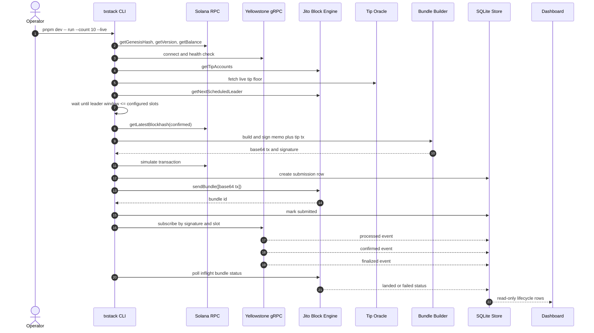
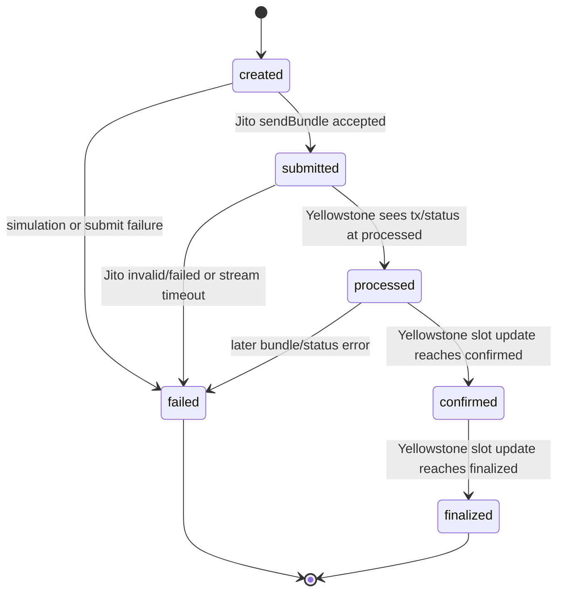
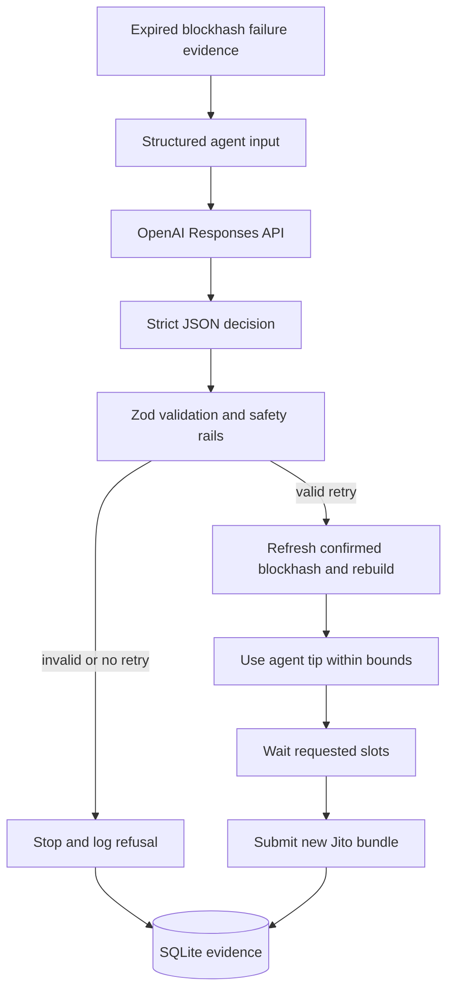
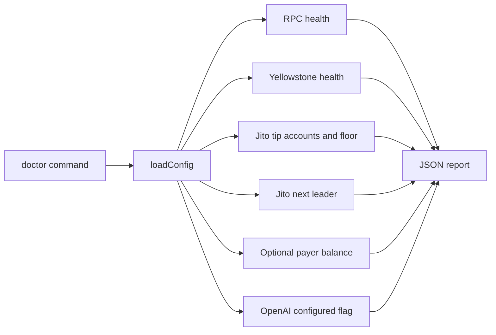
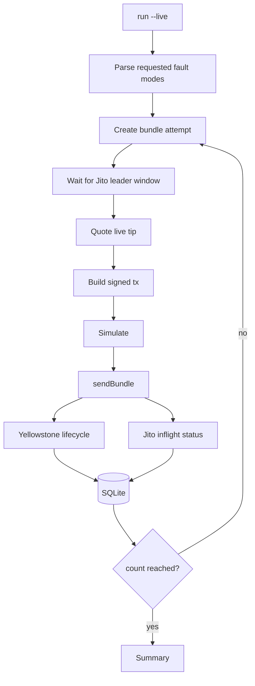
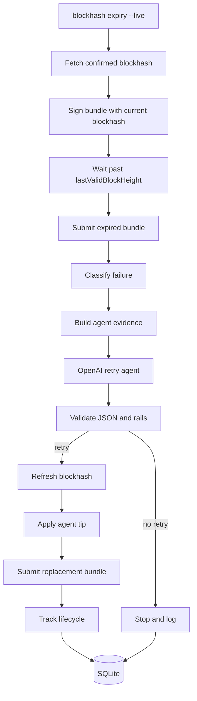
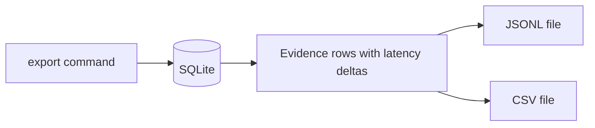

# Smart Transaction Stack Architecture

This is the architecture document for the Advanced Infrastructure Challenge submission. It explains the actual implementation in this repository, how each service participates in transaction execution, how lifecycle evidence is collected, and how the AI retry agent makes one real operational decision.

Companion artifact: [architecture-animated.html](architecture-animated.html) is a standalone animated execution walkthrough. Open it locally in a browser or publish it as a public static page alongside this document.

## 1. Executive Summary

The Smart Transaction Stack is a TypeScript/Node infrastructure prototype for submitting and observing Solana transactions through the same path a production searcher or latency-sensitive application would care about:

1. Observe live Solana network state through Yellowstone gRPC.
2. Detect Jito-connected leader windows.
3. Pull live Jito tip account and tip-floor data.
4. Build a signed versioned transaction that contains a memo plus a Jito tip transfer.
5. Submit the transaction as a Jito bundle.
6. Track the bundle and transaction from submission through processed, confirmed, and finalized lifecycle stages.
7. Persist evidence in a local SQLite store.
8. Export judge-readable JSONL and CSV logs.
9. Use an OpenAI agent to make the retry decision for the required blockhash-expiry fault injection demo.

The stack intentionally avoids mock lifecycle data. The dashboard and exports stay empty until real submissions write evidence. Devnet is used only for live RPC tests that devnet can honestly support. Jito bundle acceptance is a mainnet path because the official Jito block engine surface exposes mainnet/testnet endpoints, not a devnet block engine.

## 2. Repository Map

The implementation is organized around infrastructure boundaries rather than UI pages:

| Area | Path | Responsibility |
| --- | --- | --- |
| CLI entrypoint | `src/cli/index.ts` | Defines `doctor`, `run`, `fault:blockhash-expiry`, `dashboard`, and `export` commands. |
| Orchestrator | `src/cli/workflows.ts` | Coordinates RPC, Yellowstone, Jito, tips, persistence, and the AI retry agent. |
| Configuration | `src/config/env.ts` | Parses `.env`, normalizes endpoints, and enforces safety rails. |
| Solana transaction builder | `src/solana/bundleBuilder.ts` | Builds memo plus Jito-tip versioned transactions. |
| Keypair loading | `src/solana/keypair.ts` | Loads the live payer keypair from path, JSON, or base58 secret. |
| Solana RPC client | `src/solana/rpc.ts` | Creates `@solana/web3.js` connections and performs read-only health checks. |
| Jito JSON-RPC | `src/jito/jsonRpcClient.ts` | Calls tip accounts, send bundle, inflight status, and bundle status methods. |
| Jito leader client | `src/jito/leaderClient.ts` | Uses Jito TS searcher client to read next scheduled Jito leader windows. |
| Tip oracle | `src/jito/tipOracle.ts` | Converts live Jito tip-floor samples into bounded tip quotes. |
| Yellowstone stream | `src/yellowstone/client.ts` | Subscribes to live gRPC transaction and slot updates. |
| Evidence store | `src/db/store.ts` | Persists submissions and lifecycle events in SQLite. |
| AI retry agent | `src/agent/retryAgent.ts` | Calls OpenAI Responses API and validates strict retry-decision JSON. |
| Failure classifier | `src/utils/failureClassifier.ts` | Maps error text into the required failure taxonomy. |
| Dashboard | `src/dashboard/*`, `src/server/dashboardServer.ts` | Serves a local read-only evidence console. |
| Live tests | `test/live-devnet.test.ts`, `test/live-mainnet.test.ts` | Gated tests that read real devnet/mainnet infrastructure. |

## 3. System Architecture

At a high level, the stack is a live transaction operations loop. The CLI creates service clients from environment config, the orchestrator runs one or more bundle attempts, streaming infrastructure records lifecycle evidence, and the dashboard/export commands read the same persisted store.



### Architectural Style

This implementation follows a command-driven service orchestration style:

- The CLI owns operator intent and spending guards.
- Each infrastructure dependency has a small adapter.
- The orchestrator composes adapters into a live transaction run.
- The persistence layer is append-friendly and idempotent.
- The dashboard is read-only and never creates evidence.
- The AI agent is not a background chatbot. It is a constrained decision service called only when the runner has real failure evidence.

## 4. Key Components

### 4.1 CLI

The CLI is the operator control plane.

Commands:

| Command | Purpose | Mutates live chain? |
| --- | --- | --- |
| `pnpm run doctor` | Checks RPC, Yellowstone, Jito tip accounts, Jito tip floor, next leader, wallet, and OpenAI config. | No |
| `pnpm dev -- run --count 10 --live` | Submits real Jito bundles and records lifecycle evidence. | Yes |
| `pnpm dev -- fault:blockhash-expiry --live` | Runs the required expired-blockhash AI retry demo. | Yes |
| `pnpm run dashboard` | Starts a local read-only dashboard over the evidence store. | No |
| `pnpm run export` | Exports persisted evidence into JSONL and CSV. | No |

The `--live` flag is required for any command that can submit bundles or spend SOL. This guard exists because the target path is mainnet for Jito bundle testing.

### 4.2 Configuration and Safety Rails

Configuration is parsed in `src/config/env.ts`.

Important values:

| Variable | Meaning |
| --- | --- |
| `SOLANA_RPC_URL` | Solana RPC endpoint used for blockhashes, balance, simulation, and secondary reads. |
| `YELLOWSTONE_ENDPOINT` | Yellowstone gRPC endpoint used for slot and transaction streaming. |
| `YELLOWSTONE_X_TOKEN` | Provider token for Yellowstone access. |
| `NETWORK` | Expected network, usually `mainnet-beta` for the final bundle evidence. |
| `JITO_BLOCK_ENGINE_HTTP` | Jito JSON-RPC base URL. |
| `JITO_BLOCK_ENGINE_GRPC` | Jito searcher client host for leader queries. |
| `JITO_TIP_FLOOR_URL` | Live Jito tip-floor endpoint. |
| `PAYER_PRIVATE_KEY` | Payer secret for live bundle submissions (base58, JSON byte array, or keypair file path). |
| `OPENAI_API_KEY` | Enables the AI retry agent. |
| `MIN_TIP_LAMPORTS` | Lower bound for dynamic tip decisions. |
| `MAX_TIP_LAMPORTS` | Upper bound for dynamic tip decisions. |
| `LEADER_WINDOW_SLOTS` | How close a Jito leader must be before the stack submits. |

The Yellowstone endpoint normalizer accepts either `fra.grpc.solinfra.dev:443` or `https://fra.grpc.solinfra.dev:443`, because the installed N-API Yellowstone client requires a URL scheme.

### 4.3 Solana RPC Layer

The RPC client is intentionally used for things RPC is good at:

- Genesis hash and version checks.
- Wallet balance checks.
- Confirmed blockhash retrieval.
- Transaction simulation.
- Secondary verification and block-height reads.

RPC polling alone is not treated as sufficient lifecycle confirmation. The landing path is tracked through Yellowstone subscriptions and Jito status APIs.

### 4.4 Yellowstone gRPC Stream

`YellowstoneClient` is the stream-based observability layer.

It is responsible for:

- Connecting to the provider's gRPC endpoint.
- Reading processed and confirmed slots for health checks.
- Subscribing to transaction and transaction-status updates by signature.
- Subscribing to slot updates with commitment filtering.
- Emitting lifecycle stage updates back to the store.

The lifecycle tracker records:

- `submitted`
- `processed`
- `confirmed`
- `finalized`

The stream is also used as an operational signal. If the submitted signature never appears before timeout, the stack classifies that as a stream or bundle failure rather than silently treating RPC absence as proof.

### 4.5 Jito Block Engine Layer

The Jito integration is split into two adapters:

1. `JitoJsonRpcClient`
   - `getTipAccounts`
   - `sendBundle`
   - `getInflightBundleStatuses`
   - `getBundleStatuses`

2. `JitoLeaderClient`
   - `getNextScheduledLeader`
   - `waitForLeaderWindow`

This split mirrors the reality of the external interfaces. Bundle status and submission are JSON-RPC calls. Leader scheduling is exposed through the Jito TS searcher client.

### 4.6 Dynamic Tip Oracle

The tip oracle reads real Jito tip-floor samples and chooses a bounded tip.

Current logic:

- If the leader is close, use a more aggressive percentile.
- If the leader is farther away, use the EMA/median style input.
- Convert SOL-denominated tip-floor values into lamports.
- Clamp the result between `MIN_TIP_LAMPORTS` and `MAX_TIP_LAMPORTS`.

The clamp is a safety rail, not a hardcoded tip. The selected value still starts from live Jito tip data.

### 4.7 Bundle Builder

The builder creates a versioned transaction with:

1. Optional compute-budget instruction for fault injection.
2. Memo instruction identifying the stack and fault mode.
3. System transfer to a real Jito tip account.

The transaction is signed by the configured payer and encoded as base64 for `sendBundle`.

Why memo plus tip?

- It is low-value and simple.
- It produces an explorer-visible signature.
- It avoids depending on a custom on-chain program.
- It keeps the focus on infrastructure behavior rather than application business logic.

### 4.8 SQLite Evidence Store

The store is the source of truth for dashboard and exports.

It stores two tables:

1. `bundle_submissions`
   - one row per bundle attempt
   - status, signature, bundle id, tip, leader, timestamps, slots, failure, agent decision

2. `lifecycle_events`
   - append-style event rows
   - submitted/processed/confirmed/finalized events
   - raw provider payloads where available

The evidence store is idempotent where repeated stream updates are possible. It preserves first-seen timestamps for lifecycle stages and updates the submission status as new evidence arrives.

### 4.9 Dashboard

The dashboard is a local read-only evidence viewer. It never calls Jito, Solana RPC, Yellowstone, or OpenAI directly. It only reads from SQLite through the dashboard server.

It shows:

- Total submissions.
- Finalized count.
- Failed count.
- Last update time.
- Signature and bundle id.
- Status and fault mode.
- Leader slot and observed lifecycle slots.
- Processed/confirmed/finalized latency deltas.
- Tip lamports and tip source.
- Failure classification and failure message.
- Agent retry summary, if present.

Because it is read-only, it cannot accidentally create fake evidence or spend funds.

### 4.10 AI Retry Agent

The AI retry agent is implemented in `src/agent/retryAgent.ts`.

The agent is used for the selected bounty mode:

> Autonomous Retry with Fault Injection

It receives real failure evidence and returns strict JSON:

```json
{
  "failure_classification": "expired_blockhash",
  "retry_action": "retry",
  "blockhash_strategy": "refresh_confirmed",
  "tip_lamports": 12000,
  "wait_slots": 1,
  "confidence": 0.91,
  "reasoning_summary": "The current block height exceeded the signed transaction's last valid block height, so refresh the confirmed blockhash, keep within the next Jito leader window, and retry with a live tip quote."
}
```

The runner validates the response with Zod before obeying it. A retry is refused unless:

- `retry_action` is `retry`.
- `blockhash_strategy` is `refresh_confirmed`.
- `tip_lamports` is inside configured safety rails.

This is how the implementation prevents the agent from becoming an unconstrained spending or execution surface.

## 5. Transaction Execution Flow

The normal execution flow is:



### Why this flow matters

On Solana, the user-visible act of "sending a transaction" hides multiple timing domains:

- blockhash lifetime
- leader schedule
- Jito auction and bundle handling
- TPU ingestion
- block production
- vote propagation
- commitment progression
- explorer-visible finality

This stack records those domains separately so the lifecycle log is operationally useful instead of being a single success/failure boolean.

## 6. Lifecycle Tracking Model

Each submission starts as `created`, then progresses through runtime-observed states.



The evidence row captures both timestamps and slots:

| Field group | Example fields | Why it matters |
| --- | --- | --- |
| Identity | `id`, `bundle_id`, `signature`, `network` | Lets judges cross-reference explorer evidence. |
| Tip | `tip_lamports`, `tip_source`, `tip_account` | Proves the tip was dynamic and tied to a real tip account. |
| Leader | `leader_slot`, `leader_identity` | Shows whether the stack submitted near a Jito leader window. |
| Timestamps | `submitted_at`, `processed_at`, `confirmed_at`, `finalized_at` | Enables latency delta analysis. |
| Slots | `submitted_slot`, `processed_slot`, `confirmed_slot`, `finalized_slot` | Enables explorer and network-state verification. |
| Failure | `failure_classification`, `failure_message` | Explains non-landed attempts. |
| Agent | `agent_decision_json` | Shows the autonomous retry decision and reasoning summary. |

### Latency deltas

The export command derives:

- `processedDeltaMs = processed_at - submitted_at`
- `confirmedDeltaMs = confirmed_at - processed_at`
- `finalizedDeltaMs = finalized_at - confirmed_at`

The most important operational signal is `confirmedDeltaMs`. A small processed-to-confirmed delta generally means healthy propagation and voting. A large delta suggests the transaction was processed quickly by a leader but took longer to receive cluster vote confidence.

## 7. Failure Handling Strategy

The stack classifies failures into the bounty-required categories plus defensive fallbacks.

| Classification | Detection source | Operational meaning | Retry posture |
| --- | --- | --- | --- |
| `expired_blockhash` | RPC/Jito error text, block-height evidence | The signed transaction used a blockhash outside its valid window. | Refresh confirmed blockhash, rebuild, retip, retry if agent approves. |
| `fee_too_low` | Jito auction/status error text | The bundle was priced below current landing conditions. | Increase tip from live data, retry only inside safety rails. |
| `compute_exceeded` | Simulation logs or runtime error text | The transaction exceeded its compute budget. | Fix compute budget or instruction path before retrying. |
| `bundle_failure` | Jito failed/invalid/not-landed status | Bundle did not land as expected. | Re-evaluate leader window, blockhash, and tip. |
| `stream_timeout` | Yellowstone did not observe lifecycle in time | The stack could not stream-confirm landing. | Treat as evidence gap or non-landing, do not silently pass. |
| `unknown` | Catch-all | Error did not match known patterns. | Preserve raw message for operator review. |

### Fault injection paths

The implementation supports:

1. `blockhash-expiry`
   - Build and sign with a real confirmed blockhash.
   - Wait until `currentBlockHeight > lastValidBlockHeight`.
   - Submit the expired transaction as a Jito bundle.
   - Record the failure.
   - Ask the AI agent whether and how to retry.

2. `compute-exceeded`
   - Insert a deliberately tiny compute-unit limit.
   - Simulate and/or submit depending on the runtime path.
   - Classify the resulting failure as compute-related.

3. `low-tip`
   - Force the tip down to the configured minimum.
   - Useful for observing fee/tip sensitivity during real runs.

## 8. AI Agent Responsibility

The agent has one operational responsibility: decide what to do after the blockhash-expiry fault.

It does not:

- sign transactions
- directly call RPC
- directly call Jito
- access private keys
- bypass tip limits
- create lifecycle data
- choose arbitrary tools

It does:

- read the failure evidence supplied by the runner
- classify the reason
- decide retry vs no retry
- choose blockhash strategy
- choose a retry tip inside safety rails
- choose a small wait before retry if useful
- provide a concise reasoning summary for the evidence log



The key design point is that the retry is not a hardcoded sequence. The runner creates evidence, asks the model for a structured decision, validates the response, and only then executes the retry path.

## 9. Infrastructure Decisions

### 9.1 Mainnet for final Jito bundle evidence

The supplied SolInfra RPC endpoint resolves to mainnet-beta. Jito bundle support is available on mainnet/testnet block engine endpoints, while devnet bundle support is not exposed in the same way. Therefore:

- Final lifecycle logs should be mainnet, low-value, explorer-verifiable runs.
- Devnet tests are limited to real devnet RPC behavior.
- The code refuses to create fake devnet bundle evidence.

### 9.2 Confirmed blockhashes instead of finalized blockhashes

The runner fetches blockhashes with `confirmed` commitment.

Reason:

- `finalized` is safer from fork risk but older.
- time-sensitive transactions have a short blockhash lifetime
- using finalized can waste valuable validity window before the bundle is even signed and submitted

This is also one of the README/judging questions, so the implementation and documentation intentionally align.

### 9.3 Stream confirmation instead of RPC-only polling

RPC polling can answer "what does the node know now?" It is not enough for the bounty's lifecycle requirement. Yellowstone streams provide live slot and transaction updates, allowing the stack to observe progression instead of only asking after the fact.

RPC still has a role:

- blockhash
- simulation
- balance
- secondary verification

But it is not the sole landing confirmation mechanism.

### 9.4 SQLite evidence store

SQLite was selected because:

- it is easy to run locally
- it avoids a separate database service for judges
- it supports durable evidence
- it can be exported deterministically
- it is sufficient for a bounty prototype

A production deployment could swap this for Postgres without changing the lifecycle model.

### 9.5 Local dashboard

The dashboard intentionally reads only the evidence store. This avoids several bad outcomes:

- no accidental spending from the dashboard
- no duplicate submissions
- no fake dashboard-only data
- no dependency on live keys to inspect historical runs

## 10. Animated Execution Walkthrough

The static diagrams above are suitable for Markdown, GitHub, Notion, and Google Docs. For presentation and judging, the repository also includes an animated HTML page:

```text
docs/architecture-animated.html
```

It shows:

- the full service topology
- moving execution pulse from operator to finalization
- step-by-step narrative
- AI retry branch
- failure classification table
- command-to-component mapping

Open locally:

```bash
open docs/architecture-animated.html
```

Or serve it:

```bash
python3 -m http.server 8080
```

Then visit:

```text
http://localhost:8080/docs/architecture-animated.html
```

## 11. Data Flow by Command

### 11.1 `doctor`



Purpose: prove live infrastructure connectivity before spending.

### 11.2 `run`



Purpose: produce the 10 real bundle submissions required by the bounty.

### 11.3 `fault:blockhash-expiry`



Purpose: satisfy the AI Agent Demonstration requirement.

### 11.4 `dashboard`

```mermaid
flowchart LR
  Browser[Browser] --> Server[Express dashboard server]
  Server --> Store[(SQLite evidence store)]
  Store --> Summary[/api/summary]
  Store --> Rows[/api/submissions]
  Summary --> UI[Dashboard UI]
  Rows --> UI
```

Purpose: inspect real evidence visually without generating data.

### 11.5 `export`



Purpose: create judge-ready lifecycle artifacts.

## 12. Evidence and Judging Alignment

| Bounty requirement | Implementation |
| --- | --- |
| Architecture document | `docs/architecture.md` and animated companion `docs/architecture-animated.html`. |
| Monitor live slot and leader data | Yellowstone health and stream client, Jito next scheduled leader client. |
| Detect correct leader window | `JitoLeaderClient.waitForLeaderWindow`. |
| Construct and submit Jito bundles | `buildMemoTipBundle` plus `JitoJsonRpcClient.sendBundle`. |
| Dynamic tips from real data | `TipOracle` reads live Jito tip-floor data and real tip accounts. |
| Track submitted/processed/confirmed/finalized | `LifecycleStore.markStage` driven by submission and Yellowstone stream events. |
| Capture timestamps, slots, latency | SQLite fields plus export-derived latency deltas. |
| Classify failures | `classifyFailure` plus runtime error sources. |
| Confirm landing using streams | Yellowstone transaction and slot subscriptions are the lifecycle source. |
| Automatic retries with blockhash refresh | `runBlockhashExpiryFault` asks the AI agent and then rebuilds with a fresh blockhash. |
| Lifecycle log with real submissions | Generated only after `run --live`; no fake evidence generated. |
| AI agent owns one decision | OpenAI structured retry decision controls the expiry retry. |

## 13. Operational Runbook

### Setup

```bash
pnpm install
cp .env.example .env
```

Fill in:

- SolInfra RPC URL
- Yellowstone endpoint/token
- Jito endpoint values
- funded payer keypair path
- OpenAI API key

### Read-only checks

```bash
pnpm typecheck
pnpm build
pnpm test
pnpm run test:live:devnet
pnpm run doctor
pnpm run test:live:mainnet
```

### Real bounty run

```bash
pnpm dev -- run --count 10 --faults blockhash-expiry,compute-exceeded --live
pnpm run export
pnpm run dashboard
```

### View dashboard

```text
http://localhost:8787
```

### Evidence files

After a real run and export:

```text
data/lifecycle/txstack.sqlite
data/lifecycle/lifecycle-<timestamp>.jsonl
data/lifecycle/lifecycle-<timestamp>.csv
```

If `data/lifecycle` is empty, that is correct until real bundle submissions have been executed.

## 14. Production Hardening Notes

This bounty implementation is intentionally focused on a working prototype. A production version would add:

- multi-region Jito block-engine selection
- persistent worker process instead of CLI-only execution
- Postgres for team-shared evidence
- alerting for stream lag and bundle failure rate
- circuit breakers for high tip floors
- Prometheus metrics
- structured logs with trace ids
- replay/backfill for missed stream intervals
- wallet isolation and hardware-backed signing
- per-run budget controls
- leader quality scoring over time

The current version already preserves the most important production habit: never treat transaction submission as the end of the story. It records the lifecycle and leaves evidence for every decision.
